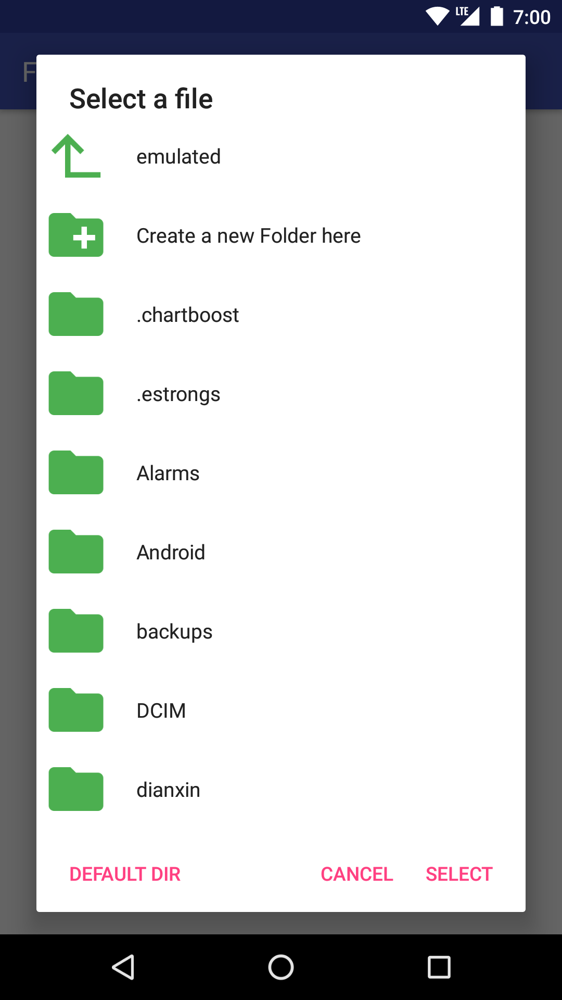
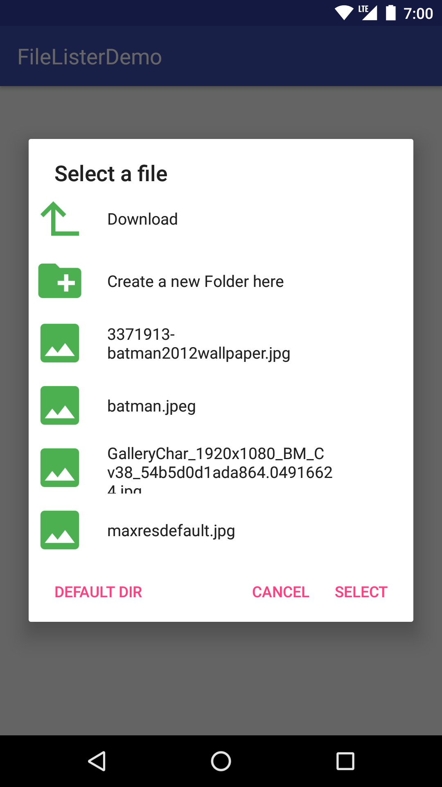
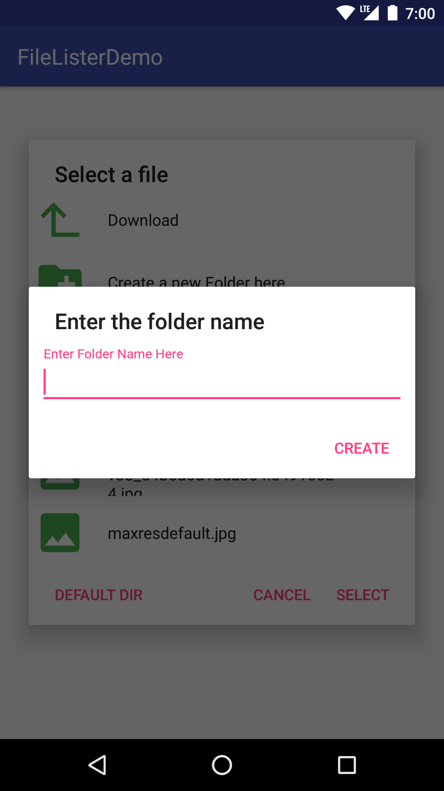
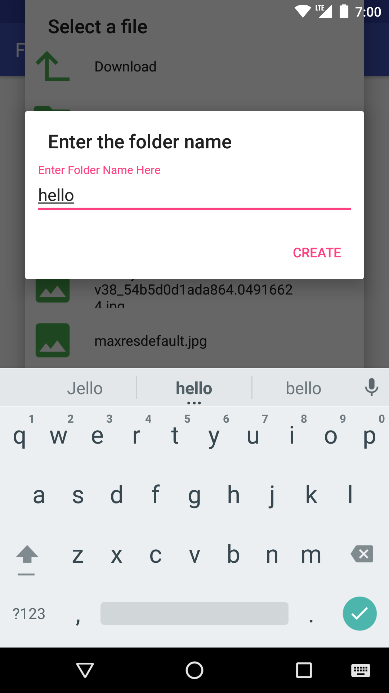
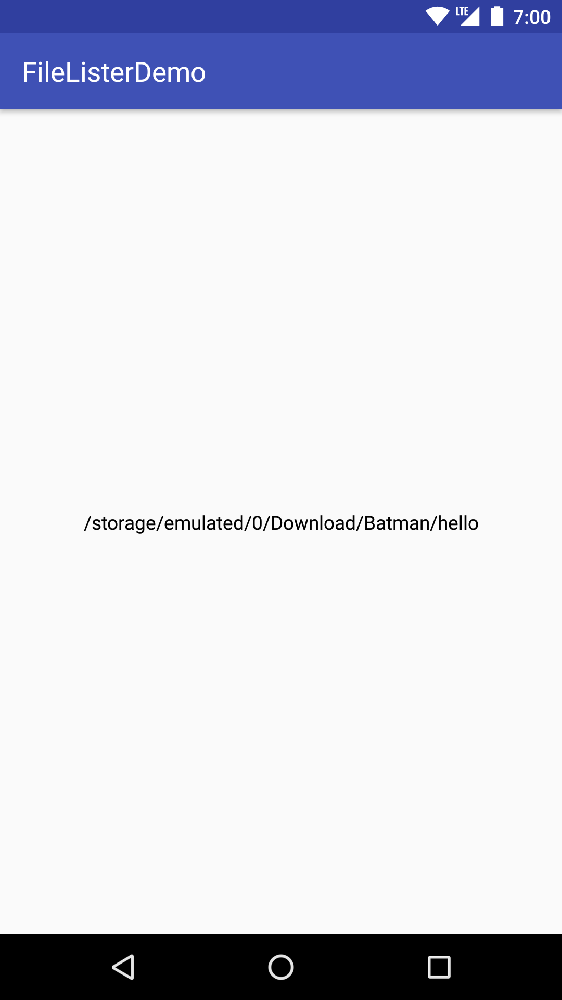

# FileListerDialog

FileListerDialog helps you to list and pick file/directory. Library is built for Android

## Getting Started

### Installing

To use this library simply import it by placing the following line under dependencies in your app module's build.gradle file

This library is posted in jCenter

```
   dependencies {
      implementation 'yogesh.firzen:FilesLister:2.0.12'
   }
```
If any problem occured while importing please add this line to your app module's build. gradle file

```
   repositories {
      maven {url "https://dl.bintray.com/firzenyogesh/maven"}
   }
```

This library has dependencies

```
   dependencies {
      implementation 'androidx.appcompat:appcompat:1.0.2'
      implementation 'com.google.android.material:material:1.0.0'
      implementation 'androidx.recyclerview:recyclerview:1.0.0'
      implementation 'yogesh.firzen:MukkiyaSevaigal:3.0.1'
      implementation 'org.apache.commons:commons-io:1.3.2'
   }
```

## Usage

After importing the library you can use FileListerDialog to list the files and pick one among them. Simply follow the steps

1. Create an instance of FileListerDialog by using the static method createFileListerDialog()
   
   Default Instance:
   ```   
      FileListerDialog fileListerDialog = FileListerDialog.createFileListerDialog(context);
   ```   
   Instance with a theme for Dialog:
   ```   
      FileListerDialog fileListerDialog = FileListerDialog.createFileListerDialog(context, themeId);
   ```   
2. Set OnFileSelectedListener so that you get what file/ directory has been selected
   ```   
      filelister.setOnFileSelectedListener(new OnFileSelectedListener() {
            @Override
            public void onFileSelected(File file, String path) {
                  //your code here
            }
      });
   ```
3. Set the default directory to load when showing the dialog:
   
   Using a file
   
   ```
      fileListerDialog.setDefaultDir(file);
   ```
   
   Using a file path
   
   ```
      fileListerDialog.setDefaultDir(path);
   ```
4. Set the File Filter type to filter the type of files to be listed:

   ```
      fileListerDialog.setFileFilter(FileListerDialog.FILE_FILTER.ALL_FILES);
   ```
   
   Possible values are:
   
   ```
      FileListerDialog.FILE_FILTER.ALL_FILES
      FileListerDialog.FILE_FILTER.DIRECTORY_ONLY
      FileListerDialog.FILE_FILTER.IMAGE_ONLY
      FileListerDialog.FILE_FILTER.VIDEO_ONLY
      FileListerDialog.FILE_FILTER.AUDIO_ONLY
      FileListerDialog.FILE_FILTER.ALL_MEDIA
      FileListerDialog.FILE_FILTER.DOCUMENT_ONLY
      FileListerDialog.FILE_FILTER.SPREADSHEET_ONLY
      FileListerDialog.FILE_FILTER.PRESENTATION_ONLY
      FileListerDialog.FILE_FILTER.ALL_DOCUMENTS
      FileListerDialog.FILE_FILTER.COMPRESSED_ONLY
      FileListerDialog.FILE_FILTER.APK_ONLY
      FileListerDialog.FILE_FILTER.CUSTOM_EXTENSION
   ```  
5. Finally call show() to open the dialog.

   ```
      fileListerDialog.show();
   ```

## Screenshots

#### FileListerDialog
 
#### Create a new folder
 

#### When a Directory is picked


#### When a file is picked


## Authors

* **Yogesh Sundaresan** -  [GitHub](https://github.com/FirzenYogesh)


## License

```
Copyright 2017 Yogesh Sundaresan

Licensed under the Apache License, Version 2.0 (the "License");
you may not use this file except in compliance with the License.
You may obtain a copy of the License at

    http://www.apache.org/licenses/LICENSE-2.0

Unless required by applicable law or agreed to in writing, software
distributed under the License is distributed on an "AS IS" BASIS,
WITHOUT WARRANTIES OR CONDITIONS OF ANY KIND, either express or implied.
See the License for the specific language governing permissions and
limitations under the License.
```
